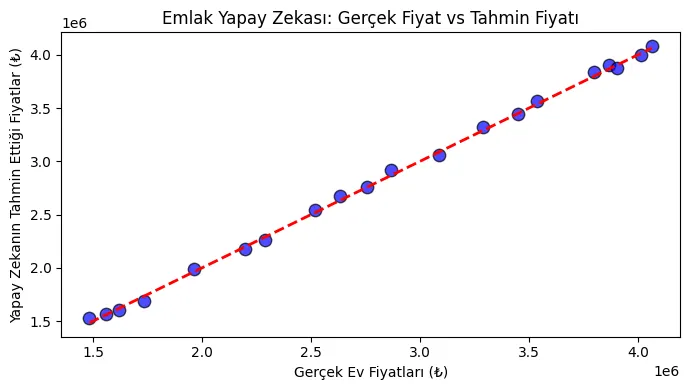

# Çoklu Doğrusal Regresyon ile Ev Fiyatı Tahmin Modeli

## Projenin Amacı ve Hikayesi
Bu proje, **Türkiye Yapay Zekâ Akademisi** ve **Huawei Student Developers (HSD)** ortaklığında düzenlenen bootcamp programının final çıktısı olarak geliştirilmiştir. 

Projenin en özgün yanı, yazarın geçmişteki **emlak sektörü saha tecrübelerine** dayanmasıdır. Sektörde gayrimenkul danışmanlarının ve alıcıların en çok zorlandığı "doğru ve objektif fiyatlandırma" problemine makine öğrenmesi ile çözüm üretilmesi hedeflenmiştir.

## Veri Seti ve Algoritma
Bir evin fiyatının sadece alansal büyüklükle ölçülemeyeceği gerçeğinden yola çıkılarak; **Metrekare, Asansör Durumu ve Otopark İmkanı** gibi temel ihtiyaçları barındıran bir veri seti simüle edilmiştir. 

Tahmin mimarisinde, sürekli bir sayısal değeri hedefleyen denetimli öğrenme algoritması **Çoklu Doğrusal Regresyon (Multiple Linear Regression)** tercih edilmiştir.

## 📈 Model Performansı
* **Model Başarı Skoru (R²):** **0.9887** (%98.8 Doğruluk)
* Geliştirilen yapay zeka modeli, girilen temel ev özelliklerine bakarak piyasa değerini neredeyse kusursuz bir doğrulukla tahmin etmeyi başarmıştır.

### Başarı Grafiği:


## 🛠️ Nasıl Çalıştırılır?
1. Gerekli paketleri kurun:
   ```bash
   pip install -r requirements.txt
   ```
2. Modeli çalıştırın ve analizi görün:
   ```bash
   python model.py
   ```
